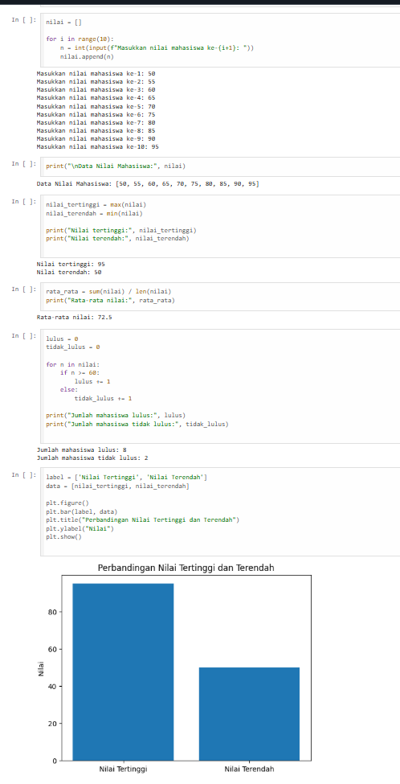

# 1. PENJELASAN KONSEP ARRAY
Array adalah struktur data yang digunakan untuk menyimpan sekumpulan data dalam satu variabel. Data yang disimpan biasanya memiliki tipe yang sama dan setiap elemen di dalam array memiliki posisi indeks yang digunakan untuk mengaksesnya. Pada Python, konsep array sering direpresentasikan menggunakan list, karena list lebih fleksibel dan paling sering digunakan.
# 2. SCREENSHOT HASIL EKSEKUSI
Berikut adalah hasil run dari program yang telah saya buat:

# 3. ANALISIS KOMPLEKSITAS
Analisis kompleksitas adalah proses untuk mengukur seberapa efisien suatu algoritma atau program dalam menggunakan waktu dan memori ketika dijalankan. Analisis ini digunakan untuk mengetahui seberapa besar sumber daya komputer yang dibutuhkan ketika ukuran data yang diproses semakin besar.
# Jenis analisis kompleksitas
1. Kompleksitas Waktu (Time Complexity)
Kompleksitas waktu menunjukkan berapa lama waktu yang dibutuhkan algoritma untuk menyelesaikan suatu masalah berdasarkan jumlah data.
2. Kompleksitas Ruang (Space Complexity)
Kompleksitas ruang menunjukkan berapa banyak memori yang digunakan oleh algoritma selama proses berjalan.
# 4. REFLEKSI PEMBELAJARAN
Pada tugas hari ini, saya mempelajari tentang konsep array, pengulangan for, dan cara berhitung dalam Python. Saya sudah memahami cara membuat array dan mengakses elemen menggunakan indeks. Namun saya masih sedikit kesulitan dalam menggunakan perulangan untuk mengolah data dalam array. Untuk memperbaikinya, saya akan mencoba lebih banyak latihan soal menggunakan array.
